# OpenEMR on AWS Fargate

- [OpenEMR on AWS Fargate](#openemr-on-aws-fargate)
- [Disclaimers](#disclaimers)
    + [Third Party Packages](#third-party-packages)
    + [General](#general)
- [Instructions](#instructions)
    + [1. Installing dependencies](#1-installing-dependencies)
    + [2. IP Range Access](#2-ip-range-access)
    + [3. Accessing OpenEMR](#3-accessing-openemr)
- [Architecture](#architecture)
- [Cost](#cost)
- [Load Testing](#load-testing)
- [Customizing Architecture Attributes](#customizing-architecture-attributes)
- [Serverless Analytics Environment](#serverless-analytics-environment)
    + [Importing OpenEMR Data into the Environment](#importing-openemr-data-into-the-environment)
    + [Jupyterlab with Persistent Storage](#jupyterlab-with-persistent-storage)
    + [Other Apps](#other-apps)
    + [Administering Access to the Environment](#administering-access-to-the-environment)
- [Automating DNS Setup](#automating-dns-setup)
- [Enabling HTTPS for Client to Load Balancer Communication](#enabling-https-for-client-to-load-balancer-communication)
- [How AWS Backup is Used in this Architecture](#how-aws-backup-is-used-in-this-architecture)
- [Using ECS Exec](#using-ecs-exec)
    + [Granting Secure Access to Database](#granting-secure-access-to-database)
- [RDS Data API](#rds-data_api)
- [Aurora ML for AWS Bedrock](#aurora-ml-for-aws-bedrock)
- [Notes on HIPAA Compliance in General](#notes-on-hipaa-compliance-in-general)
- [REST and FHIR APIs](#rest-and-fhir-apis)
- [Using AWS Global Accelerator](#using-aws-global-accelerator)
- [Regarding Security](#regarding-security)
    + [Using cdk_nag](#using-cdk-nag)
    + [Container Vulnerabilities](#container-vulnerabilities)
- [Useful commands](#useful-commands)

# Disclaimers

### Third Party Packages
This package depends on and may incorporate or retrieve a number of third-party
software packages (such as open source packages) at install-time or build-time
or run-time ("External Dependencies"). The External Dependencies are subject to
license terms that you must accept in order to use this package. If you do not
accept all of the applicable license terms, you should not use this package. We
recommend that you consult your company’s open source approval policy before
proceeding.

Provided below is a list of External Dependencies and the applicable license
identification as indicated by the documentation associated with the External
Dependencies as of Amazon's most recent review.

THIS INFORMATION IS PROVIDED FOR CONVENIENCE ONLY. AMAZON DOES NOT PROMISE THAT
THE LIST OR THE APPLICABLE TERMS AND CONDITIONS ARE COMPLETE, ACCURATE, OR
UP-TO-DATE, AND AMAZON WILL HAVE NO LIABILITY FOR ANY INACCURACIES. YOU SHOULD
CONSULT THE DOWNLOAD SITES FOR THE EXTERNAL DEPENDENCIES FOR THE MOST COMPLETE
AND UP-TO-DATE LICENSING INFORMATION.

YOUR USE OF THE EXTERNAL DEPENDENCIES IS AT YOUR SOLE RISK. IN NO EVENT WILL
AMAZON BE LIABLE FOR ANY DAMAGES, INCLUDING WITHOUT LIMITATION ANY DIRECT,
INDIRECT, CONSEQUENTIAL, SPECIAL, INCIDENTAL, OR PUNITIVE DAMAGES (INCLUDING
FOR ANY LOSS OF GOODWILL, BUSINESS INTERRUPTION, LOST PROFITS OR DATA, OR
COMPUTER FAILURE OR MALFUNCTION) ARISING FROM OR RELATING TO THE EXTERNAL
DEPENDENCIES, HOWEVER CAUSED AND REGARDLESS OF THE THEORY OF LIABILITY, EVEN
IF AMAZON HAS BEEN ADVISED OF THE POSSIBILITY OF SUCH DAMAGES. THESE LIMITATIONS
AND DISCLAIMERS APPLY EXCEPT TO THE EXTENT PROHIBITED BY APPLICABLE LAW.

 * openemr (Repository: https://github.com/openemr/openemr // License: https://github.com/openemr/openemr/blob/master/LICENSE) - GPL-3.0

### General

AWS does not represent or warrant that this AWS Content is production ready.  You are responsible for making your own independent assessment of the information, guidance, code and other AWS Content provided by AWS, which may include you performing your own independent testing, securing, and optimizing. You should take independent measures to ensure that you comply with your own specific quality control practices and standards, and to ensure that you comply with the local rules, laws, regulations, licenses and terms that apply to you and your content.  If you are in a regulated industry, you should take extra care to ensure that your use of this AWS Content, in combination with your own content, complies with applicable regulations (for example, the Health Insurance Portability and Accountability Act of 1996).   AWS does not make any representations, warranties or guarantees that this AWS Content will result in a particular outcome or result. 

# Instructions

These setup instructions assume that you've setup an AWS account and configured the AWS CDK. If you haven't done that we'd advise looking at [this documentation for setting up an AWS account](https://docs.aws.amazon.com/SetUp/latest/UserGuide/setup-overview.html) and [this documentation for setting up the AWS CDK](https://docs.aws.amazon.com/cdk/v2/guide/getting_started.html) before reviewing the instructions below. 

### 1. Installing dependencies

This project is set up like a standard Python project.  The initialization
process also creates a virtualenv within this project, stored under the `.venv`
directory.  To create the virtualenv it assumes that there is a `python3`
(or `python` for Windows) executable in your path with access to the `venv`
package. If for any reason the automatic creation of the virtualenv fails,
you can create the virtualenv manually.

To manually create a virtualenv on MacOS and Linux:

```
$ python3 -m venv .venv
```

After the init process completes and the virtualenv is created, you can use the following
step to activate your virtualenv.

```
$ source .venv/bin/activate
```

If you are a Windows platform, you would activate the virtualenv like this:

```
% .venv\Scripts\activate.bat
```

Once the virtualenv is activated, you can install the required dependencies.

```
$ pip install -r requirements.txt
```

Create ECS Service accounts.

```
$ aws iam create-service-linked-role --aws-service-name ecs.amazonaws.com --description "ECS Service Role"
$ aws iam create-service-linked-role --aws-service-name ecs.application-autoscaling.amazonaws.com --description "ECS Service Role for Application Autoscaling"
```

At this point you can now synthesize the CloudFormation template for this code.

```
$ cdk synth
```

You can also deploy using CDK as well.

```
$ cdk deploy
```

To add additional dependencies, for example other CDK libraries, just add
them to your `setup.py` file and rerun the `pip install -r requirements.txt`
command.

### 2. IP Range Access

By default, if you run `cdk deploy`, the security group that is assigned to the load balancer won't be open to the public internet. This is for security purposes. Instead we need to allowlist an IP range using the cdk.json file. As an example:

```
"security_group_ip_range_ipv4": null
```

could be set to

```
"security_group_ip_range_ipv4": "31.89.197.141/32",
```

Which will give access to only `31.89.197.141`.

### 3. Accessing OpenEMR

After we run `cdk deploy`, we will receive a url in the terminal. Going to that URL on our browser will take us to the OpenEMR authentication page.


Username is `admin` and password can be retrieved from [AWS Secrets Manager](https://aws.amazon.com/secrets-manager/). Navigate to the AWS console and go the Secrets Manager service. You will see a secret there which has a name that starts with `Password...`.


After entering username and password we should be able to get access to the OpenEMR UI.


# Architecture

This solution uses a variety of AWS services including [Amazon ECS](https://aws.amazon.com/ecs/), [AWS Fargate](https://aws.amazon.com/fargate/), [AWS WAF](https://aws.amazon.com/waf/), [Amazon CloudWatch](https://aws.amazon.com/cloudwatch/). For a full list you can review the cdk stack. Architecture diagram below shows how this solution comes together.


# Cost

You'll pay for the AWS resources you use with this architecture but since that will depend on your level of usage we'll compute an estimate of the base cost of this architecture (this will vary from region to region).

- AWS Fargate ($0.079/hour base cost) [(pricing docs)](https://aws.amazon.com/fargate/pricing/)
- 1 Application Load Balancer ($0.0225/hour base cost) [(pricing docs)](https://aws.amazon.com/elasticloadbalancing/pricing/)
- 2 NAT Gateways ($0.09/hour base cost) [(pricing docs)](https://aws.amazon.com/vpc/pricing/#:~:text=contiguous%20IPv4%20block-,NAT%20Gateway%20Pricing,-If%20you%20choose)
- Elasticache Serverless ($0.0084/hour base cost) [(pricing docs)](https://aws.amazon.com/elasticache/pricing/)
- 2 Secrets Manager Secrets ($0.80/month) [(pricing docs)](https://aws.amazon.com/secrets-manager/pricing/)
- 1 WAF ACL ($5/month) [(pricing docs)](https://aws.amazon.com/waf/pricing/)
- 1 KMS Key ($1/month) [(pricing docs)](https://aws.amazon.com/kms/pricing/)

This works out to a base cost of $152.72/month. The true value of this architecture is its ability to rapidly autoscale and support even very large organizations. For smaller organizations you may want to consider looking at some of [OpenEMR's offerings in the AWS Marketplace](https://aws.amazon.com/marketplace/seller-profile?id=bec33905-edcb-4c30-b3ae-e2960a9a5ef4) which are more affordable.

# Load Testing

We conducted our own load testing and got promising results. On a Mac the steps to reproduce would be:
- Install [homebrew](https://brew.sh/) by running `/bin/bash -c "$(curl -fsSL https://raw.githubusercontent.com/Homebrew/install/HEAD/install.sh)"`
- `brew install watch`
- `brew install siege`
- `watch -n0 siege -c 255 $ALB_URL -t60m`

CPU and memory utilization did increase while stress testing occurred but average utilization peaked at 18.6% for CPU utilization and 30.4% for memory utilization. The architecture did not need to use ECS autoscaling to provision additional Fargate containers to handle the load and thus our base cost for Fargate did not increase beyond the base cost of $0.079/hour during testing. The load balancer was comfortably serving more than 4000 requests/second and the active connection count peaked above 1300. The response time for all requests never exceeded 0.8s. Additionally RDS and Elasticache also performed well with ACU utilization and average read and write request latency remaining low. 

We did not notice any change in the responsiveness of the UI while testing occurred. Detailed tables for metrics can be found below.

ALB Metrics:<br />


CPU and Memory Application Utilization Metrics:<br />


Redis on Elasticache Metrics:<br />


RDS Metrics:<br />


# Customizing Architecture Attributes

There* are some additional parameters you can set in `cdk.json` that you can use to customize some attributes of your architecture.

 * `security_group_ip_range_ipv4`       Set to a [IPV4 cidr](https://en.wikipedia.org/wiki/Classless_Inter-Domain_Routing#IPv4_CIDR_blocks) to allow access to a group of IVP4 addresses (i.e. "0.0.0.0/0"). Defaults to "null" which allows no access to any IPV4 addresses.
 * `security_group_ip_range_ipv6`       Set to a [IPV6 cidr](https://en.wikipedia.org/wiki/Classless_Inter-Domain_Routing#IPv6_CIDR_blocks) to allow access to a group of IVP6 addresses (i.e. "::/0"). Defaults to "null" which allows no access to any IPV6 addresses.
 * `openemr_service_fargate_minimum_capacity`       Minimum number of fargate tasks running in your ECS cluster for your ECS service running OpenEMR. Defaults to 2.
 * `openemr_service_fargate_maximum_capacity`      Maximum number of fargate tasks running in your ECS cluster for your ECS service running OpenEMR. Defaults to 100.
 * `openemr_service_fargate_cpu_autoscaling_percentage`        Percent of average CPU utilization across your ECS cluster that will trigger an autoscaling event for your ECS service running OpenEMR. Defaults to 40.
 * `openemr_service_fargate_memory_autoscaling_percentage`        Percent of average memory utilization across your ECS cluster that will trigger an autoscaling event for your ECS service running OpenEMR. Defaults to 40.
 * `enable_long_term_cloudtrail_monitoring`        By default the architecture comes with a Cloudtrail Trail that logs all events in the same region the architecture is deployed to and stores them in Cloudwatch Logs for 9 years in addition to storing them in S3 for 7 years. You can choose to disable this for testing but we would recommend leaving it enabled for production settings. Defaults to "true".
 * `enable_ecs_exec`          Can be used to toggle ECS Exec functionality. Set to a value other than "true" to disable this functionality. Please note that this should generally be disabled and only enabled as needed. Defaults to "false".
 * `certificate_arn`          If specified will enable HTTPS for client to load balancer communications and will associate the specified certificate with the application load balancer for this architecture. This value, if specified, should be a string of an ARN in AWS Certificate Manager.
 * `activate_openemr_apis`          Setting this value to `"true"` will enable both the [REST](https://github.com/openemr/openemr/blob/master/API_README.md) and [FHIR](https://github.com/openemr/openemr/blob/master/FHIR_README.md) APIs. You'll need to authorize and generate a token to use most of the functionality of both APIs. Documentation on how authorization works can be found [here](https://github.com/openemr/openemr/blob/master/API_README.md#authorization). When the OpenEMR APIs are activated the `"/apis/"` and `"/oauth2"` paths will be accessible. To disable the REST and FHIR APIs for OpenEMR set this value to something other than "true". For more information about this functionality see the `REST and FHIR APIs` section of this documention. Defaults to "false".
 * `enable_bedrock_integration`          Setting this value to `"true"` will enable the integration to [Aurora ML for Bedrock for MySQL](https://docs.aws.amazon.com/AmazonRDS/latest/AuroraUserGuide/mysql-ml.html#using-amazon-bedrock). Some inspiration for what to use this integration for can be found [here](https://docs.aws.amazon.com/AmazonRDS/latest/AuroraUserGuide/mysql-ml.html#using-amazon-bedrock). More information about this integration can be found in the [Aurora ML for AWS Bedrock](#aurora-ml-for-aws-bedrock) section of this documentation. Defaults to "false".
 * `enable_data_api`          Setting this value to `"true"` will enable the [RDS Data API](https://docs.aws.amazon.com/rdsdataservice/latest/APIReference/Welcome.html) for our databases cluster. More information on the RDS Data API integration with our architecture can be found in the [RDS Data API](#rds-data_api) section of this documentation. Defaults to "false".
 * `open_smtp_port`          Setting this value to `"true"` will open up port 587 for outbound traffic from the ECS service. Defaults to "false".
 * `enable_global_accelerator`  Setting this value to `"true"` will create an [AWS global accelerator](https://aws.amazon.com/global-accelerator/) endpoint that you can use to more optimally route traffic over Amazon's edge network and deliver increased performance (especially to users who made be located far away from the region in which this architecture is created). More information on the AWS Global Accelerator integration with our architecture can be found in the [Using AWS Global Accelerator](#using-aws-global-accelerator) section of this documentation. Defaults to "false".
 * `enable_patient_portal`          Setting this value to `"true"` will enable the OpenEMR patient portal at ${your_installation_url}/portal. Defaults to "false".
 * `create_serverless_analytics_environment`          Setting this value to `"true"` will create an attached serverless analytics environment with an EMRServerless Cluster, automated pipelines to export all data from OpenEMR into S3, and a fully functional SageMaker studio environment set up to leverage the EMRServerless Cluster for Apache Spark jobs and the OpenEMR data in S3 for machine learning.  More information on the serverless analytics environment can be found in the [Serverless Analytics Envrionment](#serverless-analytics-environment) section of this documentation. Defaults to "false".

MySQL specific parameters:

 * `aurora_ml_inference_timeout`          Defaults to "30000" milliseconds. Only used if AWS Bedrock integration is enabled. Documentation can be found [here](https://docs.aws.amazon.com/AmazonRDS/latest/AuroraUserGuide/mysql-ml.html#using-amazon-bedrock:~:text=aurora_ml_inference_timeout).
 * `net_read_timeout`          Defaults to "30000" seconds. Documentation can be found [here](https://dev.mysql.com/doc/refman/8.4/en/server-system-variables.html#sysvar_net_read_timeout).
 * `net_write_timeout`          Defaults to "30000" seconds. Documentation can be found [here](https://dev.mysql.com/doc/refman/8.4/en/server-system-variables.html#sysvar_net_write_timeout).
 * `wait_timeout`          Defaults to "30000" seconds. Documentation can be found [here](https://dev.mysql.com/doc/refman/8.4/en/server-system-variables.html#sysvar_wait_timeout).
 * `connect_timeout`          Defaults to "30000" seconds. Documentation can be found [here](https://dev.mysql.com/doc/refman/8.4/en/server-system-variables.html#sysvar_connect_timeout).
 * `max_execution_time`          Defaults to "3000000" milliseconds. Documentation can be found [here](https://dev.mysql.com/doc/refman/8.4/en/server-system-variables.html#sysvar_max_execution_time).

DNS specific parameters:

The following parameters can be set to automate DNS management and email/SMTP setup.

 * `route53_domain`
 * `configure_ses`
 * `email_forwarding_address`

For documentation on how these parameters can be used see the [Automating DNS Setup](#automating-dns-setup) section of this guide.

# Serverless Analytics Environment

In an ideal world operating an EMR would not only be cheap, it would be profitable. The purpose of this serverless analytics environment is to enable large scale machine learning on the data within OpenEMR and to do so in a way that's not only HIPAA-eligible but also costs nothing unless you actually use the setup. You can leverage the full suite of [AWS Sagemaker](https://aws.amazon.com/sagemaker/?p=pm&c=sm&z=1) tools to train machine learning against your data in your OpenEMR installation within the environment. This way medical providers can train medical AIs using the data in their EMR setup and either release those as open-source or monetize them and in doing so may potentially find that running their EMR in this manner is not only cost-effective; it's profitable.

Amazon Sagemaker is a [HIPAA eligible service](https://docs.aws.amazon.com/whitepapers/latest/architecting-hipaa-security-and-compliance-on-aws/amazon-sagemaker.html) and all data in SageMaker studio is [encrypted at rest by default](https://docs.aws.amazon.com/whitepapers/latest/sagemaker-studio-admin-best-practices/data-protection.html). Your entire SageMaker domain, any EFS file systems provisioned for your domain, and export S3 buckets are all encrypted with a unique customer-managed KMS key that's automatically provisioned for your AWS account.

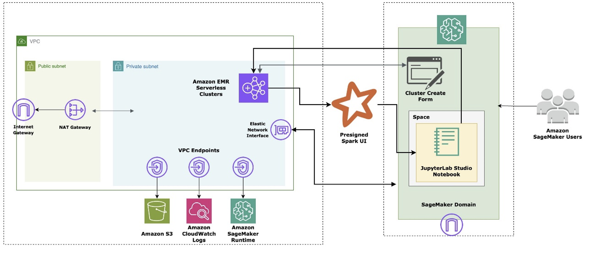
(credits to [this article](https://aws.amazon.com/blogs/machine-learning/use-langchain-with-pyspark-to-process-documents-at-massive-scale-with-amazon-sagemaker-studio-and-amazon-emr-serverless/) for the original version of the above diagram)

In our architecture the Sagemaker domain exists within the same private subnets that host our application. The login page is accessed by navigating to `"https://<your-aws-region-here>.console.aws.amazon.com/sagemaker/home?region=<your-aws-region-here>#/studio-landing"` while logged into the console as a user with appropriate IAM permissions.

When you navigate to the landing page you'll be greeted with the option to pick a user profile and get started. Select `"ServerlessAnalyticsUser"` from the dropdown and then click "Open Studio" to get started.
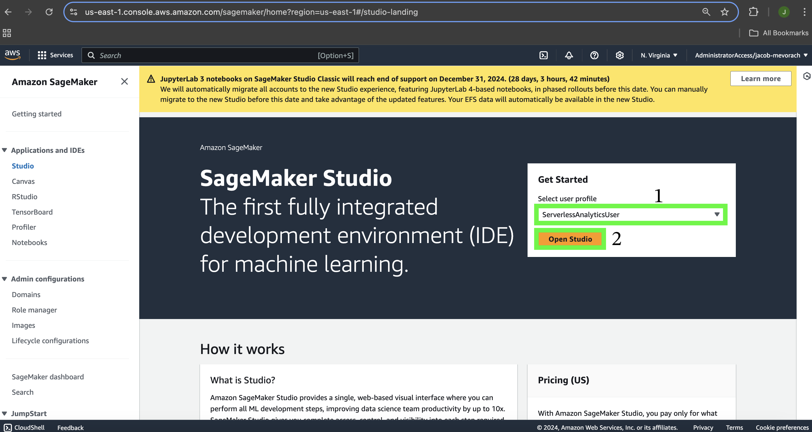

Welcome to Sagemaker Studio! If you navigate to the `"Data"` section of the menu on the side you'll be able to see our EMRServerless cluster we can submit Spark jobs to.
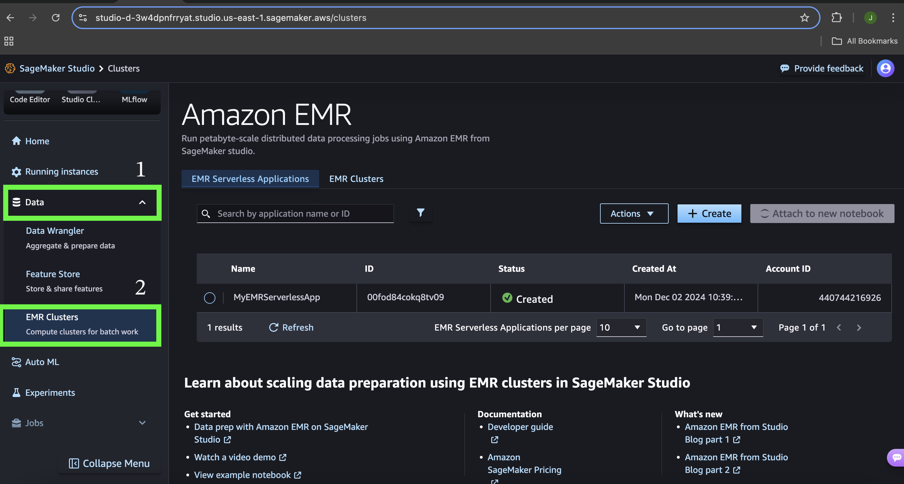

It's easiest to work with data in Sagemaker Studio when it's in an S3 bucket so there's two automated pipelines you can leverage to get data securely from OpenEMR into two S3 buckets accessible from Sagemaker Studio.

You can export all of the files stored by the EMR to an S3 bucket you can read and write to from Sagemaker Studio. When the analytics environment is created there's a lambda made with the logical ID "EFStoS3ExportLambda" which when invoked will trigger a sync between the EFS and S3 with the logical ID "EFSExportBucket" and return an ECS task ID you can poll to monitor the state of the transfer. Your Sagemaker Studio profile has permissions to invoke the lambda, to describe the ECS task ID returned from the lambda and to read and write to/from the destination s3 bucket. 


You can export all of the contents of OpenEMR's RDS Aurora Serverless v2 MySQL database to an S3 bucket you can read and write to from Sagemaker Studio. When the analytics environment is created there's a lambda made with the logical ID "RDStoS3ExportLambda" which when invoked will trigger a sync between the RDS and S3 with the logical ID "S3ExportBucket" and return a response object for the `"start_export_task"` API call which can be parsed to find (amongst other potentially useful information) an RDS export task you can poll to monitor the state of the transfer. Your Sagemaker Studio profile has permissions to invoke the lambda, to describe the RDS export task ID returned from the lambda and to read and write to/from the destination s3 bucket. 


Both transfer jobs are idempotent and can be run while the system is live with no downtime. The whole environment costs no money unless you choose to provision and use compute resources in it; for as long as it sits idle you will incur zero costs. If you do choose to use it you can find SageMaker pricing documentation [here](https://aws.amazon.com/sagemaker/pricing/?p=pm&c=sm&z=2).

### Importing OpenEMR Data into the Environment

Start by invoking at least one of the export Lambdas mentioned above. For the purposes of this demo we're going to use the Lambda that exports the OpenEMR sites directory from EFS to S3. If you have permissions you can invoke it from the console. It will take around ~3-4 seconds to successfully complete.


That will launch a tiny (0.25 vCPU; 0.5GB) graviton Fargate task that will run until all the data is copied over. Your SageMaker execution role has permissions to describe this ECS task and you can poll it if you'd like to get up to date reports on its status. This ECS task's runtime will depend on how much file storage your OpenEMR installation is using. When it's done you can see the contents have been copied to the S3 bucket.

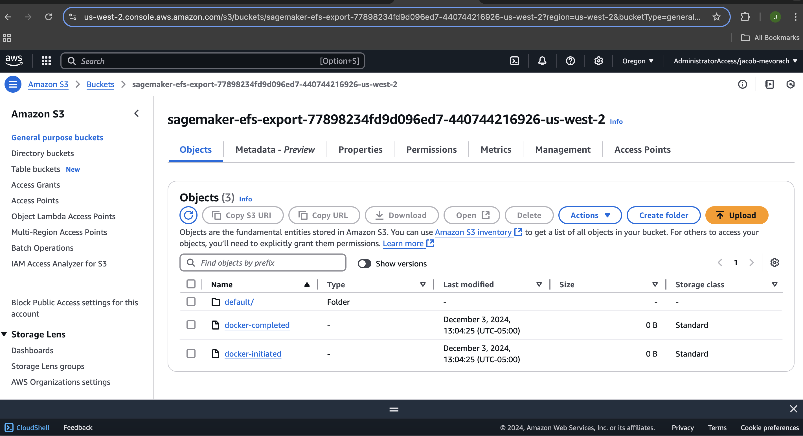

Your Sagemaker execution role has read and write access to both of the export S3 buckets (the one pictured above is for file exports from OpenEMR; the other one is for MySQL/RDS exports from OpenEMR which will appear as a bunch of [Apache Parquet](https://github.com/apache/parquet-format) files that are ready for you to run [Apache Spark](https://spark.apache.org/) jobs against with your EMRServerless cluster) and we now have many ways available to us to import data into Sagemaker for use in our applications. My preferred method is using [Data Wrangler](https://aws.amazon.com/sagemaker/data-wrangler/), which is accessible in the Sagemaker Canvas console, because then you can use a UI and then just click on the S3 bucket and the items you want to download but you could also do this programmatically from a Jupyterlab notebook or a number of other ways with other apps.

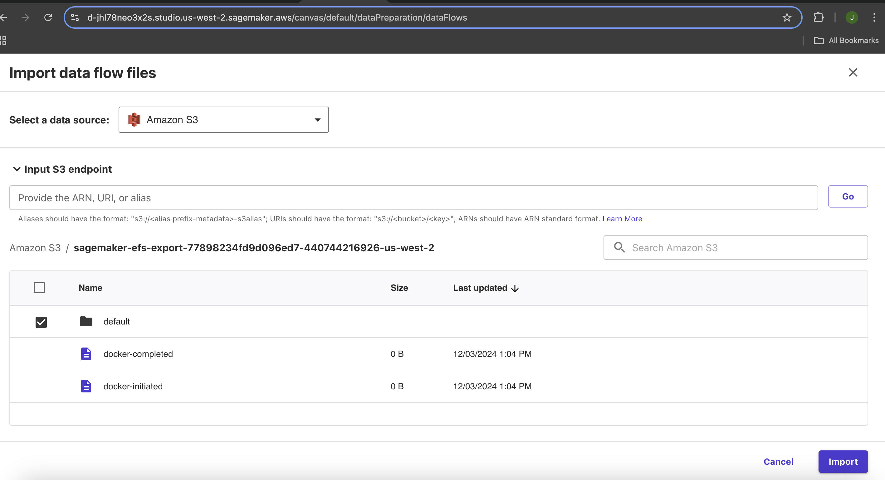

### Jupyterlab with Persistent Storage

As someone who has professionally managed a Jupyterhub server in the past I can confidently say that my favorite Sagemaker feature is its Jupyterlab app. It comes setup by default and has persistent storage via a shared EFS volume and comes ready with a bunch of coding tools you can use to get started doing data analysis. To get started let's log in to Sagemaker Studio; then in the home screen click on the Jupyterlab app in the upper left hand corner of the screen.

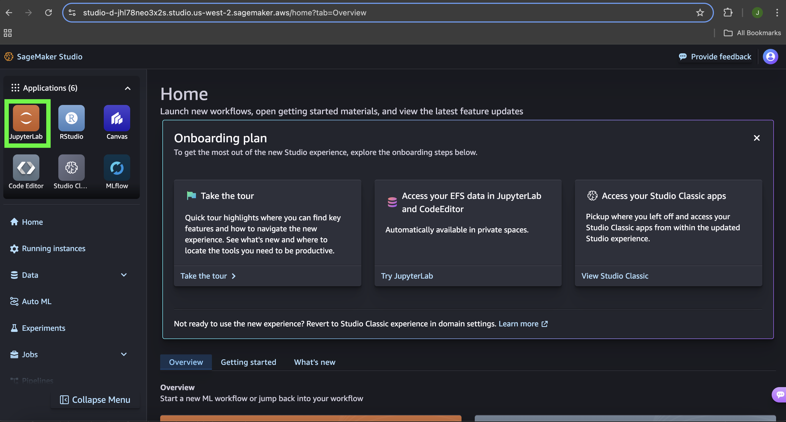

Next click on "Create Jupyterlab Space" in the upper right-hand corner of the console.

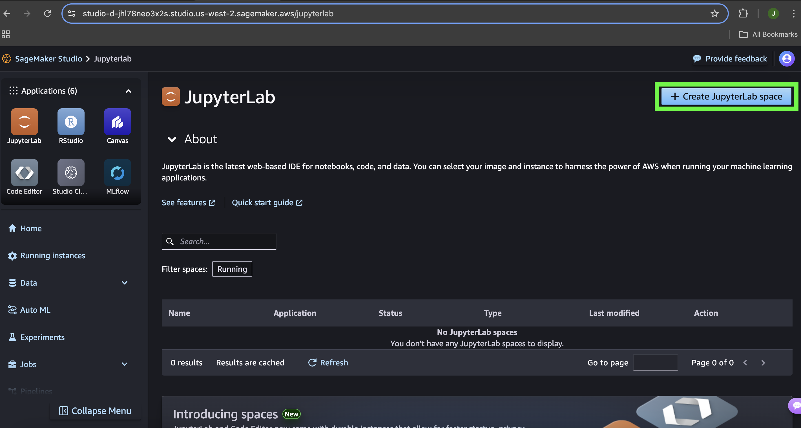

You'll have the option to create either a private or a public space. The only difference is that a private space gets allocated an EFS that only your user can access while a public space gets allocated an EFS that multiple users can access at the same time. Having said that this architecture will only provision a single user profile called "ServerlessAnalyticsUser". If you're planning to make any additional Sagemaker user profiles and wanted to share things between them I'd recommend using a public space. Otherwise, it doesn't matter what you choose here.

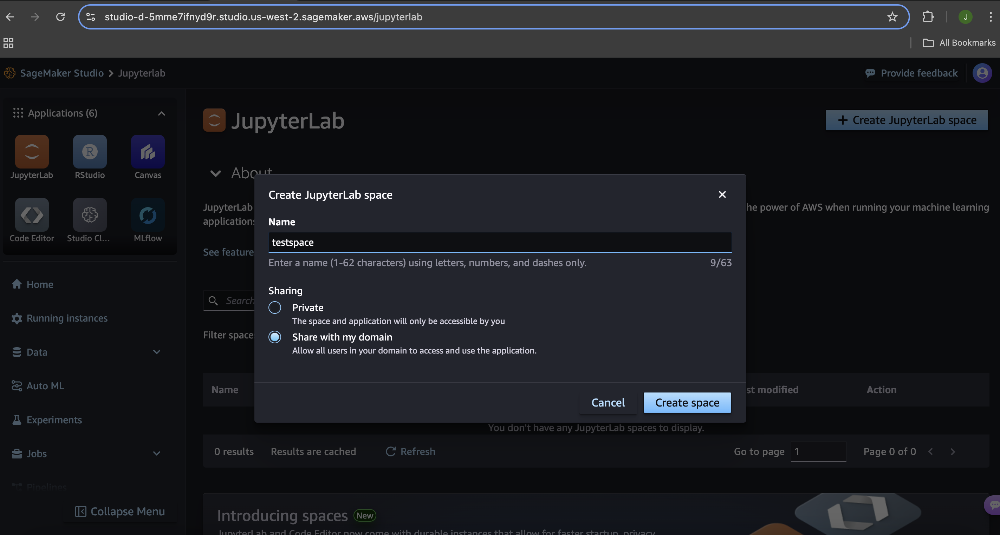

On the next screen allocate as much as you'd like for storage space and then push the "run space" button.

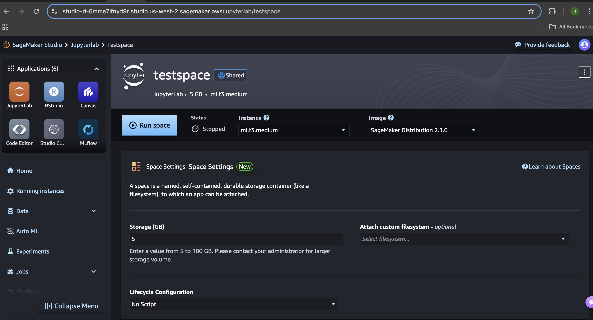

Now an update box on the bottom will appear saying "Creating Jupyterlab application for space: `$YOUR_SPACE_NAME_HERE`" and then will change to "Successfully created Jupyterlab app for space: `$YOUR_SPACE_NAME_HERE`". This should take around 3 or 4 minutes.

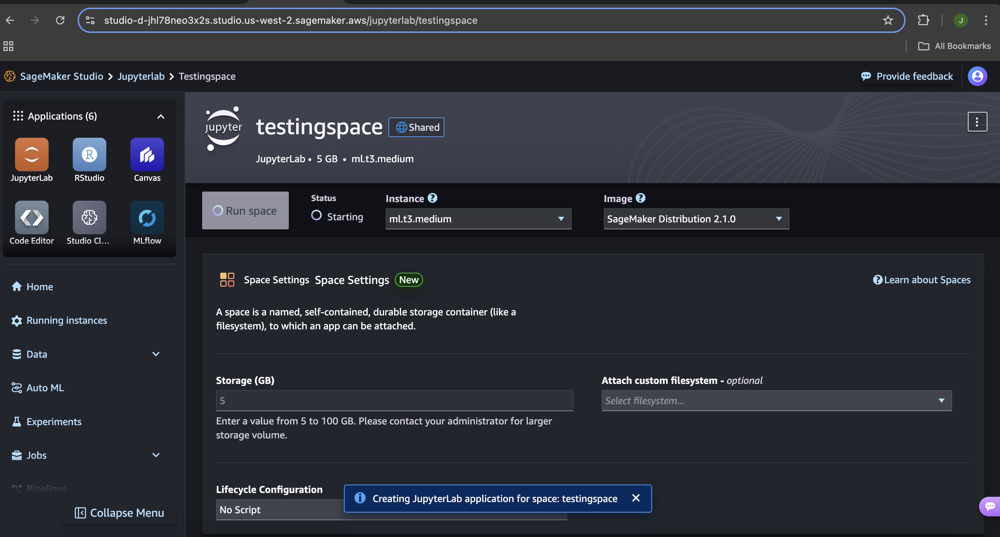

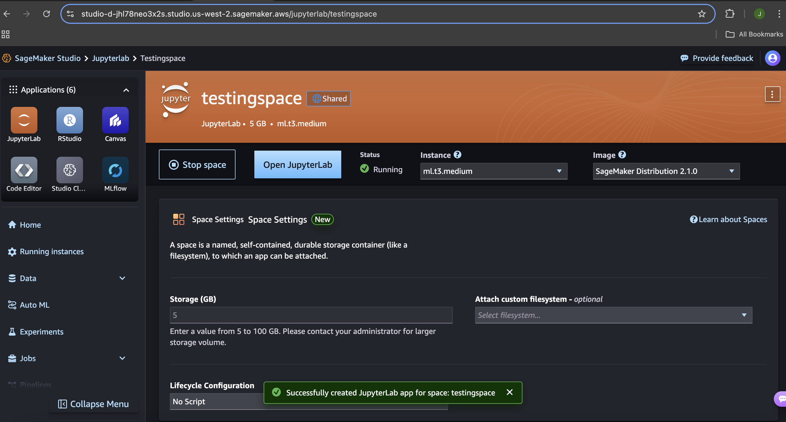

Once that's done you'll have the ability to open up Jupyterlab from the main Jupyterlab menu by clicking on the "Open" button.

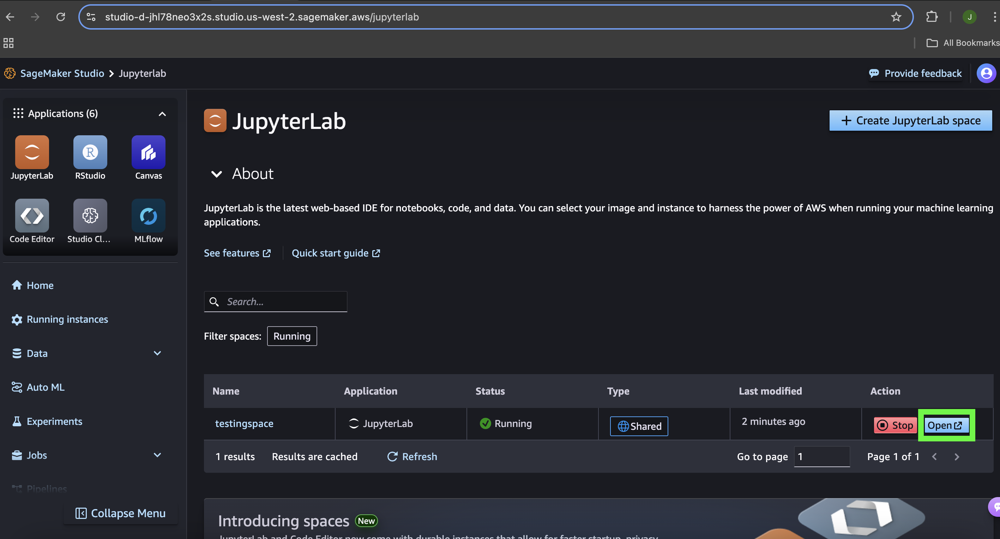

When the app first starts it can take up to 4-5 minutes to boot. This occurs while the kernel app is still booting and doing other things in the background. After around 30 minutes or so I find that it generally is quicker to open up a Jupyter notebook. Once it loads you'll see the screen below.

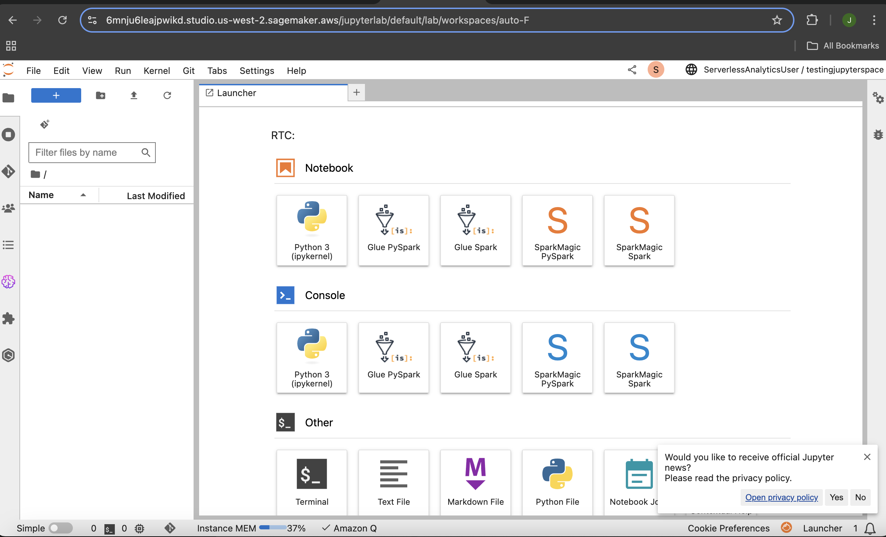

Your automatically set home directory is on a shared customer-key owned KMS encrypted EFS volume that will autoscale up and down and persist data between sessions and as multiple people write to it. You can prove that this is the case by opening up a terminal in Jupyterlab and running "`printf "My home directory is on the EFS and here's proof:\n" && df -h``"; the output of which can be seen below.


### Other Apps

While Jupyterlab is my favorite app in Sagemaker you have access to the full suite of tools and anything that can integrate with and submit jobs to our EMRServerless cluster is set up to do so.

On the upper left-hand corner of the home screen in Sagemaker Studio you can see the 6 default apps you'll have available when you provision the environment. For reference these apps are:


They are (in-order) ... :

1. Jupyterlab<br />
2. Rstudio (requires you to [purchase an RStudio license](https://docs.aws.amazon.com/sagemaker/latest/dg/rstudio-license.html) from RStudio PBC to use)<br />
3. Canvas (where the Data Wrangler functionality I showed earlier is located)<br />
4. Code Editor<br />
5. Studio Classic (will reach end of maintenance on December 31st 2024)<br />
6. MLFlow<br />

### Administering Access to the Environment

Access is controlled to the serverless analytics environment by AWS IAM. All of the functionality above requires IAM permissions and this functionality can be entirely or partially removed by restricting these permissions. Good documentation regarding best practices for IAM management as it relates to Sagemaker can be found [here](https://docs.aws.amazon.com/whitepapers/latest/sagemaker-studio-admin-best-practices/permissions-management.html).

# Automating DNS Setup

Note: to use SES with OpenEMR to send emails you will need to follow [the documentation from AWS to take your account out of SES sandbox mode](https://docs.aws.amazon.com/ses/latest/dg/request-production-access.html) (when you create an AWS account it starts out in sandbox mode by default).

If you want to get started as quickly as possible I'd recommend purchasing a route53 domain by following [these instructions](https://docs.aws.amazon.com/Route53/latest/DeveloperGuide/domain-register.html#domain-register-procedure-section).

If `route53_domain` is set to the domain of a public hosted zone in the same AWS account the architecture will automate the setup and maintenance of SSL materials. A certificate with auto-renewal enabled will be generated for HTTPS and an alias record accessible from a web browser will be created at https://openemr.${domain_name} (i.e. https://openemr.emr-testing.com).

if `route53_domain` is set and `configure_ses` is set to "true" then the architecture will automatically configure SES for you and encode functioning SMTP credentials that can be used to send email into your OpenEMR installation. The email address will be notifications@services.${route53_domain} (i.e. notifications@services.emr-testing.com). To test that your SMTP setup is properly functioning there's an awesome testmail.php script from Sherwin Gaddis (if you're reading this thanks Sherwin!) that you [can read more about and download for free here](https://community.open-emr.org/t/how-do-i-actually-send-an-email-to-my-client-from-within-openemr/20647/9).

Note: if you configure SES you will need to activate your SMTP credentials in the OpenEMR console. Log in as the admin user and then click on "Config" in the "Admin" tab followed by "Notifications" in the sidebar followed by the "Save" button. No need to change any of the default values; they'll be set for you.


Once you get your SMTP credentials functioning and you follow the instructions linked to above for setting up testmail.php you should be able to navigate to https://openemr.${domain_name}/interface/testmail.php and see something like this.


if `route53_domain` is set and `configure_ses` is set to "true" and `email_forwarding_address` is changed from null to an external email address you'd like to forward email to (i.e. target-email@example.com) the architecture will set up an email that you can use to forward email to that address. The email address will be help@${route53.domain} (i.e. help@emr-testing.com) and emailing it will archive the message in an encrypted S3 bucket and forward a copy to the external email specified.

If you'd like to rotate the SMTP credentials you can:
1. Rotate the credentials for the IAM user `"ses-smtp-user"`.
2. Invoke the `SMTPSetup` lambda.
3. Update the OpenEMR ECS Service.
4. Using the OpenEMR admin user save the new notification configuration with the updated SMTP password.

Using these services will incur extra costs. See here for pricing information on [route53](https://aws.amazon.com/route53/pricing/), [AWS Certificate Manager](https://aws.amazon.com/certificate-manager/pricing/), and [AWS SES](https://aws.amazon.com/ses/pricing/). 

# Enabling HTTPS for Client to Load Balancer Communication

If the value for `certificate_arn` is specified to be a string referring to the ARN of a certificate in AWS Certificate Manager this will enable HTTPS on the load balancer.

Incoming requests on port 80 will be automatically redirected to port 443 and port 443 will be accepting HTTPS traffic and the load balancer will be associated with the certificate specified.

The certificate used must be a public certificate. For documentation on how to issue and manage certificates with AWS Certificate Manager see [here](https://docs.aws.amazon.com/acm/latest/userguide/gs.html). For documentation on how to import certificates to AWS Certificate Manager see [here](https://docs.aws.amazon.com/acm/latest/userguide/import-certificate.html).

One of the advantages of issuing a certificate from AWS Certificate Manager is that AWS Certificate Manager provides managed renewal for AWS issued TLS/SSL certificates. For documentation on managed renewal in AWS Certificate Manager see [here](https://docs.aws.amazon.com/acm/latest/userguide/managed-renewal.html).

# How AWS Backup is Used in this Architecture

This architecture comes set up to use [AWS Backup](https://aws.amazon.com/backup/) and has automatic backups set up for both AWS EFSs and the RDS database.

The backup plan used is `daily_weekly_monthly7_year_retention` which will take daily, weekly and monthly backups with 7 year retention.

For documentation on AWS Backup see [here](https://docs.aws.amazon.com/aws-backup/latest/devguide/whatisbackup.html).

# Using ECS Exec

This architecture allows you to use ECS Exec to get a root command line prompt on a running container. Please note that this should generally be disabled while running in production for most workloads. For information on how to toggle this functionality see the `enable_ecs_exec` parameter in the `Customizing Architecture Attributes` section of this documentation.

For more instructions on how to use ECS Exec see [here](https://docs.aws.amazon.com/AmazonECS/latest/developerguide/ecs-exec.html#ecs-exec-enabling-and-using).

For an example of a command that could be run either in [AWS CloudShell](https://docs.aws.amazon.com/cloudshell/latest/userguide/welcome.html) or elsewhere to get root access to a container see the code below:

```
aws ecs execute-command --cluster $name_of_ecs_cluster \
    --task $arn_of_fargate_task \
    --container openemr \
    --interactive \
    --command "/bin/sh"
```

### Granting Secure Access to Database

Turning on ECS Exec allows you to grant secure access to the MySQL database using [AWS Systems Manager](https://docs.aws.amazon.com/toolkit-for-vscode/latest/userguide/systems-manager-automation-docs.html).

The "port_forward_to_rds.sh" file found in the "scripts" can be used on any machine that can run bash to port forward your own port 3306 (default MySQL port) to port 3306 on the Fargate hosts running OpenEMR. 

This allows you to access the database securely from anywhere on Earth with an internet connection. This allows you to do something like download [MySQL Workbench](https://dev.mysql.com/downloads/workbench/) or your other preferred free GUI MySQL management tool and start managing the database and creating users. Once you have access to the database the sky's the limit; you could also run complex queries or use your whole EHR database for [RAG powered LLM queries](https://python.langchain.com/docs/tutorials/sql_qa/).  

We'll now review some steps you can use to get started doing this.

1. Enable ECS Exec for the architecture with the appropriate parameter. Note that you can toggle this functionality on or off at any time by toggling ECS Exec.
2. Go to the CloudFormation console and find and click on the link that will take us to our Database in the RDS console: <br />  <br />
3. Once in the RDS console note and copy down the hostname for our writer instance: <br />  <br />
4. Go back to the CloudFormation console and find and copy the name of our ECS cluster: <br />  <br />
5. Run the "port_forward_to_rds.sh" script with the name of the ECS cluster as the first argument and the hostname of the writer instance as the second argument: <br />  <br />
6. You can now use the autogenerated database admin credentials stored in DBsecret to log in access the MySQL database as the admin: <br />  <br />
7. Click the "Retrieve Secret Value" button to reveal the admin database credentials: <br />  <br />
8. Use the username and password to access the MySQL database as the admin user: <br />  <br />
9. You can now securely access the OpenEMR database from anywhere on Earth! Here's a screenshot of me accessing the Database from my laptop using MySQL Workbench and then remotely creating a MySQL function that allows me to call the [Claude 3 Sonnet Foundation Model](https://aws.amazon.com/about-aws/whats-new/2024/03/anthropics-claude-3-sonnet-model-amazon-bedrock/) using the [AWS Bedrock service](https://aws.amazon.com/bedrock) from within MySQL: <br />  <br /> 

Some Notes on Providing Secure Database Access:
- SSL is [automatically enforced](https://aws.amazon.com/about-aws/whats-new/2022/08/amazon-rds-mysql-supports-ssl-tls-connections/) for all connections to the database. The SSL materials required for accessing the database can be downloaded for free [here](https://truststore.pki.rds.amazonaws.com/global/global-bundle.pem). 
- Toggling ECS Exec off will block anyone, anywhere from accessing the database like this.
- You can log in using the admin user but in general when granting access to the database you should use the admin user to make another MySQL user with the appropriate levels of permissions.
- To be able to port forward you'll need the appropriate IAM permissions to do start an SSM session on the Fargate nodes.
- Even after you port forward you'll need a set of credentials to access the database.
- All data sent over the port forwarding connection is encrypted.
- Access logs are automatically collected for all accesses performed using this method and stored in an encrypted S3 bucket.

# RDS Data API

You can toggle on and off the [RDS Data API](https://docs.aws.amazon.com/AmazonRDS/latest/AuroraUserGuide/data-api.html) by setting the "enable_data_api" in the "cdk.json" file.

Setting this to "true" will enable the RDS Data API for our database. Here's a short description of the RDS Data API from ChatGPT:

"The Amazon RDS (Relational Database Service) Data API allows you to access and manage RDS databases, particularly Amazon Aurora Serverless, through a RESTful API without requiring a persistent database connection. It’s designed for serverless and web-based applications, simplifying database operations with SQL statements through HTTP requests. The RDS Data API supports SQL queries, transactions, and other operations, making it useful for applications needing quick, scalable, and stateless access to relational data in the cloud."

Because we use Aurora Serverless v2 in our architecture you're able to make unlimited requests per second to the RDS Data API. More information on the RDS Data API for Aurora Serverless v2 can be found [here](https://aws.amazon.com/blogs/database/introducing-the-data-api-for-amazon-aurora-serverless-v2-and-amazon-aurora-provisioned-clusters/).

There's a script named "test_data_api.py" found in the "scripts" folder that will allow you to test the RDS Data API. On line 8 specify the Amazon Resource Name (ARN) of your RDS database cluster and on line 9 specify the ARN of the Secrets Manager database secret. Then you can execute an SQL statement of your choosing that you specify on line 13. The region on line 5 is set to "us-east-1" but if you deployed your architecture to a different AWS region then make sure to specify that region instead.  

Note that using this functionality will incur extra costs. Information on pricing for the RDS Data API can be found [here](https://aws.amazon.com/rds/aurora/pricing/?refid=d0d2d16d-a4b1-420d-b102-bf8ef4afa0c9#Data_API_costs).

# Aurora ML for AWS Bedrock

Note: Not all integrations are enabled for all versions of the Aurora MySQL engine at all times. New engine versions often don't ship with features like the Bedrock integration enabled but instead have them enabled later. We try to keep the MySQL engine set by default to one of the more recent versions of the engine. If you want to enable this feature you may need to change the MySQL engine version to a previous version. If you need to do this change the `"self.aurora_mysql_engine_version"` variable in [openemr_ecs_stack.py](https://github.com/openemr/host-openemr-on-aws-fargate/blob/main/openemr_ecs/openemr_ecs_stack.py). 

You can toggle on and off the [Aurora ML for AWS Bedrock Integration](https://docs.aws.amazon.com/AmazonRDS/latest/AuroraUserGuide/mysql-ml.html#using-amazon-bedrock) by setting the "enable_bedrock_integration" parameter in the "cdk.json" file.

Setting this to "true" will allow you to [enable access to foundation models in AWS Bedrock](https://docs.aws.amazon.com/bedrock/latest/userguide/getting-started.html) and then get started using foundation models for whatever use cases you can think of!

You'll be able to create MySQL functions that make calls to Bedrock foundation models and ask LLMs questions about the data in your database like "How many patients have appointments today?" or "Based off Patient X's medical history what would be a good course of treatment to recommend if he's presenting with these symptoms and why?".

Note that enabling this optional functionality will incur extra costs. Information on pricing for AWS Bedrock can be found [here](https://aws.amazon.com/bedrock/pricing/).

# Notes on HIPAA Compliance in General

If you are an AWS customer who is a HIPAA covered entity you would need to sign a business associate addendum (BAA) before running anything that would be considered in-scope for HIPAA on AWS.

Please note that you would have to sign a separate business associate addendum for _each AWS account_ where you would want to run anything that would be considered in-scope for HIPAA on AWS.

Documentation on HIPAA compliance on AWS in general and how one would sign a BAA can be found [here](https://aws.amazon.com/compliance/hipaa-compliance/).

You can use AWS Artifact in the AWS console to find and agree to the BAA. Documentation on getting started with using AWS Artifact can be found [here](https://aws.amazon.com/artifact/getting-started/).

While this may assist with complying with certain aspects of HIPAA we make no claims that this alone will result in compliance with HIPAA. Please see the general disclaimer at the top of this README for more information.

# REST and FHIR APIs

OpenEMR has functionality for both [FHIR](https://github.com/openemr/openemr/blob/master/FHIR_README.md) and [REST](https://github.com/openemr/openemr/blob/master/API_README.md) APIs. We'll walk through step-by-step example of how to generate a token to make calls to the FHIR and REST APIs. The script we'll use for this walkthough is the "api_endpoint_test.py" file found in the "scripts" folder in this repository.

To use the APIs you'll need to have HTTPS enabled for the communication from the client to the load balancer and to have the OpenEMR APIs turned on. As a result, before proceeding with the rest of this walkthrough make sure that in your `cdk.json` file you've specified an ACM certificate ARN for `certificate_arn` and that `activate_openemr_apis` is set to `"true"`.

1. Wait for the `cdk deploy` command to finish and for the stack to build. Then obtain the value for the DNS name of our ALB from either the Cloudformation console <br />  <br /> or the terminal you ran `cdk deploy` in <br /> 
2. Change directory to the `"scripts"` folder in this repository and run the "api_endpoint_test.py" script using the value obtained in part 1. That should look something like this <br />  <br /> and yield an output that looks like this <br />  <br /> at the bottom of the output you should see a message instructing you to "Enable the client with the above ID". 
3. To "Enable the client with the above ID" first copy the value in green below <br />  <br /> then log in to OpenEMR and navigate to the API Clients menu as shown below <br />  <br /> then in the menu find the registration where the Client ID corresponds with the value noted above <br />  <br /> and then click on the "edit" button next to that registration and in the following menu click the "Enable Client" button <br />  <br /> and if all goes well the client registration should now reflect that it is enabled like so <br /> .
4. Now that we've enabled our client let's go back to our script that's still running in our terminal and press enter to continue. We should get an output like this <br />  <br /> and our script has generated a URL we should go to to authorize our application. 
5. Before we navigate to that URL let's make a patient (in the event we didn't already have testing patient data imported) by going to the following menu <br />  <br /> and adding a fake patient for testing purposes with data and clicking the `"Create New Patient"` button like so <br /> 
6. Now let's navigate to the URL obtained in part 4 in our webbrowser where we should be prompted to login and should look like this <br /> . <br /> Log in with the admin user and password stored in secrets manager. 
7. Keep in mind that the next three steps are time sensitive. We're going to obtain a code in steps 8 and 9 that is short lived and needs to be used relatively quickly to get back an access token which can then be used to make API calls over an extended period of time. I'd recommend reading ahead for steps 8-10 so that you can step through them reasonably fast.
8. Then let's select our testing user <br />  <br /> which should bring us to a screen that looks like this <br />  <br /> and then scroll to the bottom of the page and click `"authorize"` <br /> 
9. Now in our example you're going to get a `"403 Forbidden"` page. That's totally fine! Notice the URL we were redirected to and copy everything after `?code=` up until `&state=` to your clipboard <br />  <br /> At this stage in the process you've registered an API client, enabled it in the console, authorized and gotten a code which we've copied to our clipboard.
10. Let's navigate back to our script that's running in the terminal and press enter to proceed. The next prompt should be instructing us to "Copy the code in the redirect link and then press enter." which if all went well in part 8 should already be done. Now let's press enter to proceed. We should see the code we copied appear in the terminal like so <br />  <br /> followed by a response containing an access token that can be used to make authenticatecd API calls that looks like this <br /> 

# Using AWS Global Acclerator

You can toggle on and off an [AWS Global Acclerator Endpoint](https://aws.amazon.com/global-accelerator/) by setting the "enable_global_accelerator" parameter in the "cdk.json" file.

Here's a short description of what AWS Global Accelerator does from ChatGPT: "AWS Global Accelerator improves the availability and performance of your applications by routing traffic through AWS's global network, automatically directing it to the closest healthy endpoint across multiple regions."

In my testing I was pleasantly surprised by how much performance was improved. If you're setting up an installation that will be used by global users or will require high speed uploads and downloads or be used by many users consider turning this on.

When enabled the URL of the global accelerator endpoint will be available as a Cloudformation output named "GlobalAcceleratorUrl" and will be printed in the terminal by CDK when the deployment completes. Route traffic to that URL rather than the URL of the ALB to experience the benefits of using AWS Global Accelerator.  

Note that using this functionality will incur extra costs. Information on pricing for AWS Global Accelerator can be found [here](https://aws.amazon.com/global-accelerator/pricing/).

# Regarding Security

### Using cdk_nag

We instrumented this project with [cdk_nag](https://github.com/cdklabs/cdk-nag). In your app.py file we placed 2 commented out cdk_nag checks.

```python
from cdk_nag import AwsSolutionsChecks, HIPAASecurityChecks

app = cdk.App()
cdk.Aspects.of(app).add(AwsSolutionsChecks(verbose=True))
cdk.Aspects.of(app).add(HIPAASecurityChecks(verbose=True))
```

If you'd like you can enable the cdk_nag checks and fix any issues found therein. While this may assist with complying with certain aspects of HIPAA we make no claims that this alone will result in compliance with HIPAA. Please see the general disclaimer at the top of this README for more information. 

### Container Vulnerabilities

We recommend periodically scanning the container image used in this project. There are multiple ways to achieve that goal. 2 of them are:

1. Upload the container image to ECR and enable scanning
2. You can use [trivy](https://github.com/aquasecurity/trivy)

# Useful commands

 * `cdk ls`          list all stacks in the app
 * `cdk synth`       emits the synthesized CloudFormation template
 * `cdk deploy`      deploy this stack to your default AWS account/region
 * `cdk diff`        compare deployed stack with current state
 * `cdk docs`        open CDK documentation

